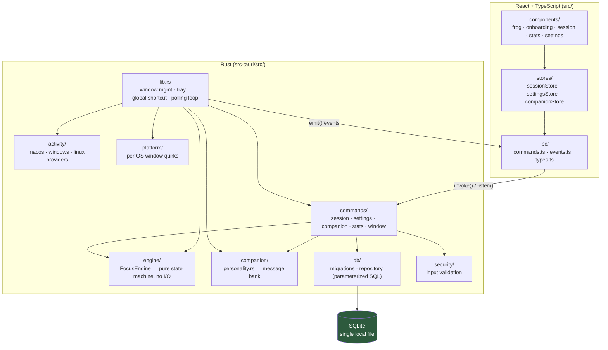

# Focus Frog

[](https://github.com/levimackay/focus-frog/actions/workflows/ci.yml)
[](LICENSE)

**Keep the promises you make to yourself.**

Focus Frog is a cross-platform desktop companion for focus sessions. You
state a goal, a duration, and what success looks like. A frog lives on your
desktop for the session. If you're genuinely focused, it stays quiet. If you
drift, it escalates — gently at first, more insistently if you keep ignoring
it — because a focus tool that nags constantly trains you to ignore it, and
one that never says anything isn't doing its job either.

> **Project status: early, active development.** This is a fresh build —
> functional end-to-end, not yet visually polished or widely tested. There
> are no packaged releases yet; see [Installation](#installation).

## Why Focus Frog exists

Most focus/pomodoro apps pick one of two failure modes: either they're a
silent timer that does nothing when you tab away to check one notification
and end up losing forty minutes, or they're an anxiety machine that
interrupts you constantly regardless of whether you actually need it.

The core idea here is that **the frog should know when to shut up.** It only
escalates when you're actually distracted, it escalates gradually instead of
jumping straight to alarm, and it comes back down the moment you're focused
again. You choose upfront exactly how far it's allowed to go — from a gentle
nudge to a full-screen intervention — so the annoyance level is a decision
you made on purpose, not a surprise.

And it is local-first on principle, not as a checkbox: no account, no cloud
backend, no telemetry, no analytics. See [PRIVACY.md](PRIVACY.md) for exactly
what is and isn't observed.

## How it works

### Starting a session

You provide:

- **A goal** — what you're working on (up to 200 characters).
- **What success looks like** — your own success criteria (up to 300
  characters).
- **A duration** — 1 minute to 4 hours.
- **An annoyance profile** — how far the frog is allowed to escalate:

  | Profile | Escalation ceiling |
  | --- | --- |
  | Gentle | Quiet encouragement only |
  | Persistent | Up to a noticeable "ignored" nudge |
  | Ruthless | Up to a prominent on-screen intervention |
  | Nuclear | All of the above, plus a full-screen focus overlay — **opt-in only**, with an explicit acknowledgment step during onboarding |

### The escalation ladder

Focus Frog watches two signals while a session is active — idle time and
which app is in the foreground — and drives a deterministic state machine:

```
Focused ──(distraction signal, sustained)──▶ Distracted
Distracted ──(sustained further)──▶ Ignored ──(sustained further)──▶ Intervention
   │                                                                     │
   └────────────────────(focus signal returns)────────▶ Recovering ◀────┘
                                                              │
                                                    (confirmed) ▶ Focused
```

A single blip doesn't flip anything — each transition requires the signal to
persist for a configurable grace period (defaults: 8s to register as
distracted, 60s to escalate to "ignored", 180s to reach "intervention", 5s of
sustained focus to fully recover). Your annoyance profile caps how far this
is allowed to climb: Gentle stops at "ignored"; only Nuclear ever reaches the
full-screen overlay. **The overlay never traps you** — it never disables OS
functionality, kills other apps, or blocks the OS-level quit path, and it's
always dismissible via acknowledgment or the emergency hotkey.

### The five personalities

The frog's voice comes from a fixed message bank, not generated text — every
line is hand-written, chosen per personality and current escalation level.
A sample of what each one actually says (full bank in
[`src-tauri/src/companion/personality.rs`](src-tauri/src/companion/personality.rs)):

- **Friendly** — *"You've got this!"* → escalating to *"Okay, real talk:
  let's get back to it together."*
- **Passive Aggressive** — *"Oh, look who's actually working."* → escalating
  to *"Take your time. I have literally nothing else to do."*
- **Drill Sergeant** — *"Good. Keep moving."* → escalating to *"DROP WHAT
  YOU'RE DOING AND REFOCUS. NOW."*
- **Chaotic** — *"WOO focus go brrr"* → escalating to *"OKAY THIS IS A LOT.
  PLEASE COME BACK."*
- **Zen** — *"Breathe. Continue."* → escalating to *"Let this be the moment
  you choose to return."*

### Ending a session

Sessions end by completing the planned duration, by you abandoning early, or
via the emergency exit (see [Keyboard Shortcuts](#keyboard-shortcuts)). On
completion you can optionally write a short journal entry, and the companion
gains a small amount of experience.

## Privacy

Local-first, by architecture, not by policy statement. No account, no cloud
sync, no telemetry, no analytics, no screenshots, no keylogging. The only
things ever observed are idle time and the foreground app's name, and only
while a session is running. Full detail, including exact OS permission
behavior and where your data lives on disk, is in [PRIVACY.md](PRIVACY.md).

## Architecture

Rust (Tauri 2) backend, React + TypeScript frontend, SQLite for local
storage. The full binding contract — state machine, IPC shapes, DB schema —
lives in [ARCHITECTURE.md](ARCHITECTURE.md); this is the module map:



Key design decisions, explained in full in `ARCHITECTURE.md`:

- **The focus engine is pure.** No timers, no I/O, no reading the system
  clock internally — every transition takes an explicit timestamp. That's
  what makes it unit-testable without `sleep` and keeps `cargo test` for the
  engine module fast.
- **Three windows, not one.** A normal main window (onboarding/settings/
  stats), a small transparent always-on-top companion window (the frog,
  session-scoped), and a nuclear-overlay window created only when escalation
  reaches level 4 under the Nuclear profile.
- **Capabilities are split per window**, not granted globally — see
  [SECURITY.md](SECURITY.md).

## Supported platforms

| Platform | Idle detection | Active-app detection |
| --- | --- | --- |
| macOS | Full support | Full support |
| Windows | Full support | Full support |
| Linux (X11) | Full support | Full support |
| Linux (Wayland) | Best-effort, compositor-dependent | Best-effort, compositor-dependent |

Linux activity detection is honest about its limits: there is no portable
protocol for idle time or active-window queries under Wayland, so support
depends on what the underlying crates can reach for a given compositor. When
a query fails on Linux, that tick reports `idle_seconds: 0.0` and
`active_app: None` rather than a fabricated value — the practical effect is
that distraction detection can't fire from a failed signal for that tick, it
never invents one. See
[`src-tauri/src/activity/linux.rs`](src-tauri/src/activity/linux.rs).

## Installation

No packaged releases exist yet. Build from source (see below) until that
changes.

## Development setup

Prerequisites:

- [Rust](https://rustup.rs/), stable toolchain
- Node.js 18+
- Platform build tools for Tauri 2 — see the
  [Tauri prerequisites guide](https://v2.tauri.app/start/prerequisites/)

```sh
npm install
npm run tauri dev
```

Other useful scripts (see `package.json`): `npm test` / `npm run test:watch`
(Vitest), `npm run typecheck`, `npm run lint`, `npm run format`. For the Rust
side: `cargo test`, `cargo fmt`, `cargo clippy` from `src-tauri/`. Full
details in [CONTRIBUTING.md](CONTRIBUTING.md).

## Building

```sh
npm run tauri build
```

Produces a platform-native installer/bundle (see `src-tauri/tauri.conf.json`
for bundle targets).

## Configuration

All settings live in one place (Settings screen in-app, persisted as a single
JSON blob in the local SQLite database):

- Escalation timing — idle threshold, distraction grace period, and the
  ignored/intervention/recovery thresholds (all configurable; defaults are
  20s / 8s / 60s / 180s / 5s respectively).
- Default annoyance profile and default companion personality.
- App-detection toggle — turn off foreground-app checks and drive
  distraction detection from idle time alone.
- Launch on startup, sound, reduced motion, theme (system/light/dark).
- Frog size and screen position.
- The emergency hotkey (see below).
- Nuclear mode opt-in — off by default; must be explicitly enabled before the
  Nuclear annoyance profile can show its full-screen overlay.
- The distracting-app list — apps you've flagged as off-task, editable from
  Settings.

## Keyboard shortcuts

| Shortcut | Action |
| --- | --- |
| `Cmd/Ctrl+Shift+Esc` (default, configurable) | **Emergency exit** — immediately abandons the active session and tears down the companion/nuclear overlay windows. Registered as a global OS shortcut, so it works even when Focus Frog isn't focused, and it is never blocked by the nuclear overlay. |

The overlay itself is also dismissible by acknowledging it (a button), and
the app can always be quit via the system tray's "Quit Focus Frog" or your
OS's normal quit shortcut — neither is ever intercepted.

## Roadmap

**In this build:** the full session flow (onboarding → active session with
escalation → completion/journal), all five personalities, all four annoyance
profiles including Nuclear, cross-platform activity detection, local stats
(weekly/monthly/all-time), settings, system tray, and the emergency hotkey.

**Architected but not yet a real feature:** the companion has a `level` and
`experience` field, and completing a session awards experience — but nothing
is done with it yet. There's no cosmetic unlock, no level-up moment, no
reward. Similarly, an `achievements` table exists in the database schema
(`first_session`, `streak_3`, etc.) but nothing currently reads or writes to
it — it's schema, not a feature. Both are natural next steps once the core
loop has been used enough to know what's actually worth rewarding.

**Explicitly out of scope for now:** cloud sync/accounts, mobile builds,
any telemetry.

## Contributing

See [CONTRIBUTING.md](CONTRIBUTING.md) — setup, test commands, style
expectations, and the PR process. [ARCHITECTURE.md](ARCHITECTURE.md) is the
binding contract for backend/frontend integration; changes that deviate from
it should update it first.

## Security

See [SECURITY.md](SECURITY.md) for the security model (Tauri capability
scoping, input validation, no shell exposure) and how to report a
vulnerability.

## License

[MIT](LICENSE) © 2026 Levi Mackay. Third-party dependency licenses are listed
in [THIRD-PARTY-NOTICES.md](THIRD-PARTY-NOTICES.md).

**Last updated:** 2026-08-24 07:33 PDT

